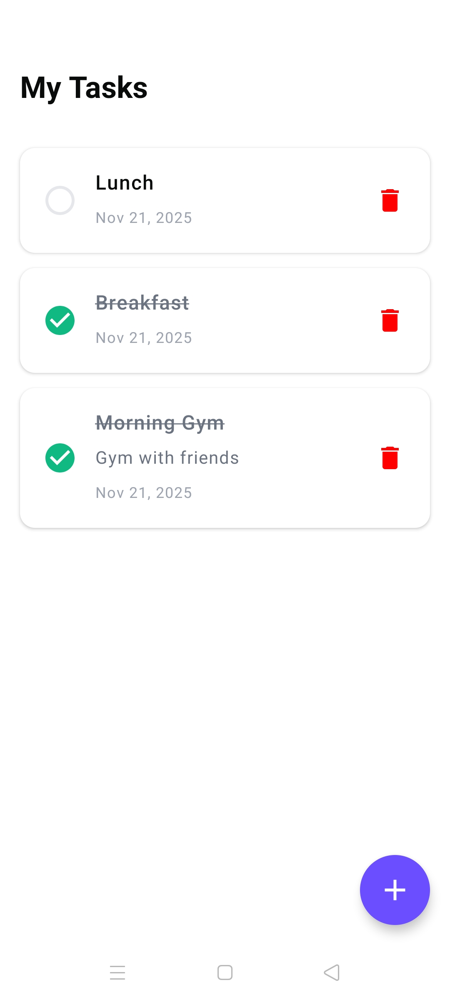

# FoxTasks

A simple task management Android app built with Jetpack Compose and Clean Architecture.

## Features

- Create, edit, and delete tasks
- Mark tasks as complete/incomplete
- View all tasks in a list
- Persistent local storage

## Note on Testing

It was my first time writing test cases. I didn't have much experience writing test cases, so I took references from various online resources and documentation to implement the unit tests for this project.

## Screenshots



## Tech Stack

### Core
- **Kotlin** - Programming language
- **Jetpack Compose** - Modern UI toolkit
- **Material 3** - Material Design components

### Architecture
- **Clean Architecture** - Separation of concerns with data, domain, and UI layers
- **MVVM** - Model-View-ViewModel pattern

### Libraries

#### Dependency Injection
- **Koin** (3.5.6) - Lightweight dependency injection

#### Database
- **Room** (2.8.3) - Local database with SQLite
- **KSP** (2.0.21-1.0.27) - Kotlin Symbol Processing for Room

#### Navigation
- **Navigation Compose** (2.9.6) - Type-safe navigation
- **Kotlinx Serialization** (1.7.3) - Serialization for navigation arguments

#### UI
- **Material Icons Extended** - Extended icon set including delete icon
- **Lifecycle ViewModel Compose** (2.6.1) - ViewModel integration

#### Testing
- **JUnit** (4.13.2) - Unit testing framework
- **MockK** (1.13.8) - Mocking library
- **Turbine** (1.0.0) - Flow testing
- **Coroutines Test** (1.7.3) - Testing coroutines
- **Arch Core Testing** (2.2.0) - Testing architecture components

## Project Structure

```
app/
├── data/
│   ├── local/          # Room database entities and DAOs
│   ├── mappers/        # Data mappers
│   └── repository/     # Repository implementations
├── domain/
│   ├── model/          # Domain models
│   ├── repository/     # Repository interfaces
│   └── usecases/       # Business logic use cases
└── ui/
    ├── detail/         # Task detail screen
    ├── list/           # Task list screen
    ├── splash/         # Splash screen
    └── theme/          # App theme and colors
```